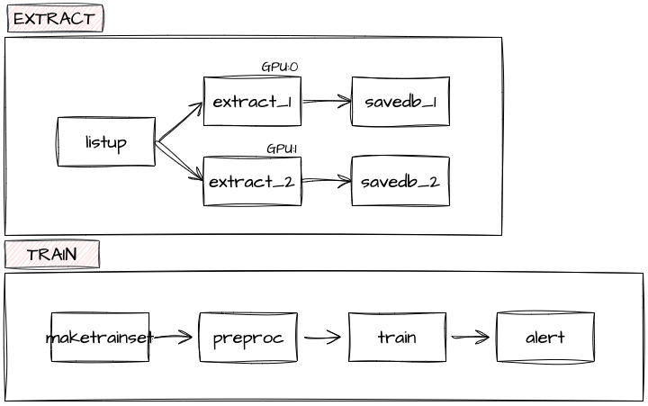

# bandee-python-pipeline

BANDEE 분석팀 파이프라인 입니다.<br>

## Architecture


## Update
- **```2022/10/11```** : 최초 구현
- **```2022/11/02```** : 파이프라인 변경
- **```2022/12/21```** : 파이프라인 변경

## Project
```
    ├── README.md               
    ├── dags/
    │   ├── bandee_extract.py           <- 데이터 추출 파이프라인
    │   ├── bandee_model_train_batch.py <- 데이터 학습 파이프라인
    │   ├── datautils/                  <- 배치 코드에 사용할 함수 디렉토리
    │   │    └── alert.py               <- 슬랙 알람 클래스          
    ├── src/
    │   ├── extract/                    <- 데이터 추출 파이프라인 코드 디렉토리
    │   └── train/                      <- 데이터 학습 파이프라인 코드 디렉토리
    ├── data/
    ├── pre-model/                      <- 추출에 사용하는 pre-train 모델 디렉토리
    ├── train-model/                    <- 학습한 모델이 저장된 디렉토리
    ├── cred/
    ├── test/                           <- 테스트 시에 사용할 코드 디렉토리
```

## Run
```
nohup airflow webserver -p 8080 > /dev/null &
nohup airflow scheduler > /dev/null &
# pkill -f airflow
```
